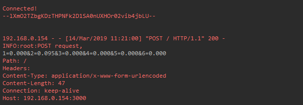
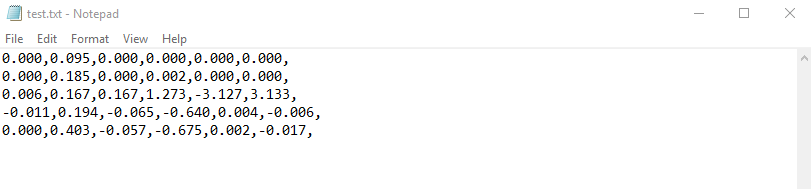

================================
AR Interface for wall-building
================================

This section describes an interface in augmented reality (AR) that was designed to build a wall structure with bricks.
The Microsoft Hololens was used to implement this, and demonstration videos can be found in the home page.

Networking Helper
------------------



The above image is a screenshot of data received in the python server console during the communication between the HoloLens client and the python server.

The white text the 6 coordinates data of frozen bricks.

In order to let the program in HoloLens transmit coordinate data via HTTP request, a helper class `NetworkingHelper` has been implemented to enable the HoloLens communicate with a server by granting access to post requests on specified IP, the server is a simple HTTP server running on python3.

Firstly, we instantiate the HTTP client for life time in the class at the very beginning::

    ```C#
    private static readonly HttpClient client = new HttpClient();
    ```

During the development, two networking methods using different modules have been tested each with:

- Unity default networking module::

    ```C#
    UnityEngine.Networking
    ```

- Asynchronous programming in .NET development::

    ```C#
    using System.Net.Http;
    using System.Threading.Tasks;
    ```

In order to obtain a more robust and stable communication, the method utilising .Net has been eventually used in the``InteractionHelper`` main function:

The function has been initiated with 6 arguments corresponding to the 3 position and 3 rotation coordinates data retrieved from the ``InteractionHelper`` main function::

    ```C#
    public async void MainAsync(
        string string1,
        string string2,
        string string3,
        string string4,
        string string5,
        string string6) {
        ...
    }
    ```

Then, Dictionary Key-Value pairs format has been used for standard Non-JSON HTTP request content::

    ```C#
    var values = new Dictionary<string, string> {
        {"1", string1},
        {"2", string2},
        {"3", string3},
        {"4", string4},
        {"5", string5},
        {"6", string6}
    };
    ```

After that, we encode the content into the standard format for HTTP request::

    ```C#
    var content = new FormUrlEncodedContent(values);
    ```

Lastly, we create the post request::

    ```C#
    var result = await client.PostAsync("http://192.168.0.154:3000", content);
    string resultContent = await result.Content.ReadAsStringAsync();
    Console.WriteLine(resultContent);
    ```

`await` keyword has been used to force the current thread to wait until the asynchronous operation has completed.

Write Text Helper
-------------------

Apart from transmitting data between a server and Hololens client, the functionality storing data to local text file has also been implemented in helper class `WriteTextHelper`

The Method utilised the `IO` module::

    ```C#
    using System.IO;
    ```

The path of the file has been defined in the main `InteractionHelper` helper class, in order to retrieve that, we cached the reference by creating a instance of the `InteractionHelper` class::

    ```C#
    private InteractionHelper interactionHelper = new InteractionHelper();
    ```

Then we assign the path value in the `WriteString` function::

    ```C#
    // need to re-assign the path variable or otherwise will encounter ArgumentNullException
    interactionHelper.path = "C:/Users/HRK/Documents/DanRoboticsBricks/test.txt";
    ```

Once again, like the Networking functions, the function has been initiated with 6 arguments corresponding to the 3 position and 3 rotation coordination data retrieved from the `InteractionHelper` main function::

    ```C#
    public void WriteString(
        string string1,
        string string2,
        string string3,
        string string4,
        string string5,
        string string6) {
        ...
    }
    ```

For the purpose of enabling the writing functionality within the function, a writer object instance has been created::

    ```C#
    StreamWriter writer = new StreamWriter(interactionHelper.path, true);
    ```

Then, write the 6 strings separating using `,`::

    ```C#
    writer.WriteLine(
        string1 + "," +
        string2 + "," +
        string3 + "," +
        string4 + "," +
        string5 + "," +
        string6 + ",");
    ```

Eventually, close the writing functionality to free memory::

    ```C#
    writer.Close();
    ```

After all the steps done, open the txt file and the data of the bricks will promptly show up:



Every time initiate the program, a clear functionality will be triggered in the `InteractionHelper` main class to wipe all the content before loading new data into it::

    ```C#
    File.WriteAllText(path, String.Empty);
    ```

Below is another more robust way of implementation, where the `stream` has been created before the writer::

    ```C#
    // create the stream before making the writer
    using (var stream = new FileStream(interactionHelper.path, FileMode.OpenOrCreate, FileAccess.Write)) {
        var writer = new StreamWriter(stream, System.Text.Encoding.UTF8);

        ...

        writer.Flush();
        writer.Dispose();
    }
    ```