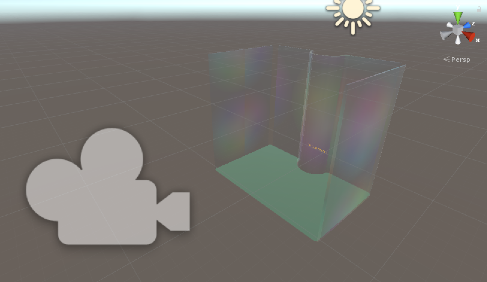

================================
AR Interface for wall-building
================================

This section describes making an interface in augmented reality (AR) that was designed to build a wall structure with bricks.
The Microsoft Hololens was used to implement this, and demonstration videos can be found in the home page.

Interaction Helper
-------------------



Introduction
-------------

The Interaction Helper C# script sits at the core of the Hololens experience. It is attached to the user's main camera, which governs everything they see.

The script sets up the user's interaction with the virtual world from ground up. Starting from defining a ray casting straight out of the center of the user's camera, it listens to the user's gestures and voice, spawns and controls the rigid body behavior of bricks and finally places, freezes and tells the networking helper and write text helper to post the brick coordinates to a simple http server and save a text file locally. The coordinates can then either be directly used by the Franka Panda robot on the other end of the server, or modified in the text file for neater designs.

Gaze - Selecting and Controlling a Brick
------------------------------------------

First, instantiate a ray cast starting from the origin of the main camera and going forward, simulating viewer's line of sight (Gaze). The update method runs at 30-60fps depending on performance.::

    ```c#
    void Update()
        {
            var ray = new Ray(Camera.main.transform.position, Camera.main.transform.forward);
            RaycastHit raycastInfo;
            ...
    }
    ```

Detect objects by collision with the ray cast, determine a change in object by checking for a change in object's mesh renderer component. To visualize this selection process, material of the currently looked at object will change.::

    ```c#
    void Update()
        {
    // Returns object that is hit by this line and sends a message
            if (Physics.Raycast(ray, out raycastInfo))
            {
                current_hit = raycastInfo.transform.gameObject;
                if (current_hit == last_hit) // Terminates operation if object in gaze hasn't changed to reduce computation
                    return;

                // If object in gaze has changed, assign its mesh renderer component of object under renderer
                var renderer = current_hit.GetComponent<Renderer>();
                // some objects don't have mesh renderers, checking for error
                if (renderer == null)
                    return;

                // If there was an object before this new object in gaze, change that object's material back to it's original material
                if (last_hit != null)
                {
                    var last_render = last_hit.GetComponent<Renderer>();
                    last_render.material = _oldMaterial;
                }

                // Don't do anything when the object in gaze is part of workspace (these are the invisible walls that shouldn't interact with the gaze)
                if (current_hit.tag == "workspace")
                    return;

                // Set old Material to the current mesh renderer material
                _oldMaterial = renderer.material;
                // Set the current mesh renderer material to a custom material in unity called MaterialInGaze
                renderer.material = MaterialInGaze;
                // Repeat process
                last_hit = current_hit;
            }
            // If nothing is hit, but there was an object in gaze in the previous frame, reset previous object's material
            else
            {
                if (current_hit == null)
                    return;
                if (last_hit == null)
                    return;
                var renderer = last_hit.GetComponent<Renderer>();
                renderer.material = _oldMaterial;
                current_hit = null;
            }
        }
    }
    ```

Finally, create a path relative to the gaze's vector and assigning the rigid body component of the active brick to it, so the active brick is controlled by the camera.::

    ```c#
    void FixedUpdate()
        {
            // Set distance (m) of the active brick in front of user's camera when in control
            float distance = 1.5f;

            // Sets the movement path for the brick, using the origin position and forward vector of the camera
            if (active_brick != null)
            {
                Rigidbody rb = active_brick.GetComponent<Rigidbody>();
                rb.MovePosition(Camera.main.transform.position + Camera.main.transform.forward * distance);
            }
        }
    ```

Gesture Listener - Spawning and Placing Bricks
-----------------------------------------------

First, initialize the gesture listener to listen to single taps, GestureRecognizer() is a built-in Unity method.::

    ```c#
    void Start()
        {
            ...
            tapRecognizer = new GestureRecognizer();
            tapRecognizer.SetRecognizableGestures(GestureSettings.Tap);
            tapRecognizer.TappedEvent += TapRecognizer_TappedEvent;
            tapRecognizer.StartCapturingGestures();
            ...
        }
    ```

On a tap event, if it's an even tap, stop gesture recognition, activate the object's gravity and nolonger have it follow the camera. The brick will drop to the workspace floor.::

    ```c#
        private void TapRecognizer_TappedEvent(InteractionSourceKind source, int tapCount, Ray headRay)
        {
            //Drops brick on even taps
            if (odd_tap == false)
            {
                //Stops registering tap events to provent spawning new bricks before server message is sent
                tapRecognizer.StopCapturingGestures();
                //changes property of active_brick to freeze_object so it nolonger follows the camera
                freeze_object = active_brick;
                active_brick = null;
                //accesses the rigid body components of the freeze_object game object and enables gravity so object falls
                rb = freeze_object.GetComponent<Rigidbody>();
                rb.useGravity = true;
                //set odd_tap to true so next tap spawns a new brick
                odd_tap = true;
                ...
            }
    }
    ```

Define a freeze method to freeze all 6 DoFs of the placed brick and reactivate gesture listener.::

    ```c#
    private void _freeze()
        {
            rb.constraints = RigidbodyConstraints.FreezeRotation | RigidbodyConstraints.FreezePosition;
            ...
            tapRecognizer.StartCapturingGestures();
        }
    ```

Activate the freeze method after 0.5 seconds, so the brick has enough time to fall.::

    ```c#
    private void TapRecognizer_TappedEvent(InteractionSourceKind source, int tapCount, Ray headRay)
        {
                ...
                //executes custom _freeze method 0.5 seconds after fall, so it has plenty of time to reach the ground
                Invoke("_freeze", 0.5f);
                ...
            }
    ```

Alternatively, if the tap was odd numbered, instantiate a new brick game object, with the same properties as the previous ones. Initialize it's rigid body properies and make it active so it follows the camera right away.::

    ```c#
    private void TapRecognizer_TappedEvent(InteractionSourceKind source, int tapCount, Ray headRay)
        {
        ...
        else
            {
                //Initializes brick model to starting position and default rotation
                var newBrickPosition = new Vector3(0f, 0.65f, -2f);
                GameObject NewBrick = Instantiate(brick_prefab, newBrickPosition, Quaternion.identity);
                //Tags the brick for easy grouping
                NewBrick.tag = "brick";
                var rb = NewBrick.GetComponent<Rigidbody>();
                //Sets rigid body properties for the brick while it's controlled by viewer's camera
                if (rb == null)
                    return;
                //Removes the effect of gravity
                rb.useGravity = false;
                //Removes velocity
                rb.velocity = Vector3.zero;
                //Set desired brick rotation
                rb.rotation = Quaternion.Euler(-90f, 0f, 0f);
                //Fixes the rotation and only allow translation
                rb.freezeRotation = true;
                //Assigning counts to the bricks array, to make it easier to access the most recent brick.
                bricks[count] = NewBrick;
                count += 1;
                //Sets NewBrick as active_brick which follows the camera movements
                active_brick = NewBrick;
                odd_tap = false;
            }
        }
    ```

Voice Listener - Resetting a Brick
-----------------------------------

Set up a voice listener to listen to phrase "reset", KeywordRecognizer is a built in unity function.::

    ```c#
    void start(){
        ...
            KeywordRecognizer resetRecognizer =
                new KeywordRecognizer(new[] { "Reset" });
            resetRecognizer.OnPhraseRecognized += ResetRecognizer_OnPhraseRecognized;
            resetRecognizer.Start();
            ...
    }
    ```

On calling "reset", reset the last brick's position and make it follow the camera again.::

    ```c#
     private void ResetRecognizer_OnPhraseRecognized(PhraseRecognizedEventArgs args)
        {
            if (active_brick != null)
                return;
            if (freeze_object == null)
                return;
            // Resets brick's rigidbody properties
            var rb = freeze_object.GetComponent<Rigidbody>();
            rb.useGravity = false;
            rb.velocity = Vector3.zero;
            // Resets brick's position
            freeze_object.transform.position = new Vector3(0f, 0.65f, -0.5f);
            // Reactives brick to follow camera position
            freeze_object = active_brick;
        }
    ```

Sending the Messages
---------------------

First, Initialize string objects at start.::

    ```c#
    void start(){
        ...
        private string posX;
        private string posY;
        private string posZ;
        private string rotX;
        private string rotY;
        private string rotZ;
        ...
    }
    ```

Create a method that reads the position and rotation of only the most recent brick, assign them to the string objects. We also created a virtual in-app text mesh that displays the coordinates of the brick real-time.::

    ```c#
    public void UpdateText()
        {
            // Indicates 1 new brick added to the scene when 'count' is bigger than 'previousCount' by 1
            // Use this logic to prevent the update() function from writing coordinates all the time
            if (count != previousCount)
            {
                lastBrickPosition = bricks[count - 1].transform.position;
                lastBrickRotation = bricks[count - 1].transform.rotation.eulerAngles; // eulerAngles is the conversion from quaternion to Vector3

                // Set the string objects to corresponding transformation variables
                posX = lastBrickPosition.x.ToString("F3");
                posY = lastBrickPosition.y.ToString("F3");
                posZ = lastBrickPosition.z.ToString("F3");
                rotX = lastBrickRotation.x.ToString("F3");
                rotY = lastBrickRotation.y.ToString("F3");
                rotZ = lastBrickRotation.z.ToString("F3");

                // Assigns the position and rotation information under positionString
                positionString =
                    posX + "," +
                    posY + "," +
                    posZ + "," +
                    rotX + "," +
                    rotY + "," +
                    rotZ + ",";
                // Shows this position on _debugText which is shown in the virtual environment
                _debugText.text = positionString;
            }
        }
    ```

Start a clock at start for running the previous update text method at a slow 2fps to reduce computation.::

    ```c#
    void start(){
        ...
        InvokeRepeating("UpdateText", 0.5f, 0.5f);
        ...
    }
    ```

Finally, to send the data through to the http server, run MainAsync(data) after the 0.5 seconds Invoke freeze function which finalizes brick placement. Doe the same with WriteString() which records the data on a local text file. Both of these functions are modularized and written seperately in the scripts: "NetworkingHelper.cs" and "WriteTextHelper.cs".::

    ```c#
     private void TapRecognizer_TappedEvent(InteractionSourceKind source, int tapCount, Ray headRay)
        {
            if (odd_tap == false)
            {
                ...
                Invoke("_freeze", 0.5f);
                // Posts the position and rotation information to the server
                networking.MainAsync(
                    posX,
                    posY,
                    posZ,
                    rotX,
                    rotY,
                    rotZ);
                // Write the position and rotation information into local text file
                writeTextHelper.WriteString(
                    posX,
                    posY,
                    posZ,
                    rotX,
                    rotY,
                    rotZ);
            }
    }
    ```

Networking Helper
------------------

.. figure::  _static/python_console.png
   :align:   center

The above image is a screenshot of data received in the python server console during the communication between the HoloLens client and the python server.

The white text the 6 coordinates data of frozen bricks.

In order to let the program in HoloLens transmit coordinate data via HTTP request, a helper class `NetworkingHelper` has been implemented to enable the HoloLens communicate with a server by granting access to post requests on specified IP, the server is a simple HTTP server running on python3.

Firstly, we instantiate the HTTP client for life time in the class at the very beginning::

    ```C#
    private static readonly HttpClient client = new HttpClient();
    ```

During the development, two networking methods using different modules have been tested each with:

- Unity default networking module::

    ```C#
    UnityEngine.Networking
    ```

- Asynchronous programming in .NET development::

    ```C#
    using System.Net.Http;
    using System.Threading.Tasks;
    ```

In order to obtain a more robust and stable communication, the method utilising .Net has been eventually used in the``InteractionHelper`` main function:

The function has been initiated with 6 arguments corresponding to the 3 position and 3 rotation coordinates data retrieved from the ``InteractionHelper`` main function::

    ```C#
    public async void MainAsync(
        string string1,
        string string2,
        string string3,
        string string4,
        string string5,
        string string6) {
        ...
    }
    ```

Then, Dictionary Key-Value pairs format has been used for standard Non-JSON HTTP request content::

    ```C#
    var values = new Dictionary<string, string> {
        {"1", string1},
        {"2", string2},
        {"3", string3},
        {"4", string4},
        {"5", string5},
        {"6", string6}
    };
    ```

After that, we encode the content into the standard format for HTTP request::

    ```C#
    var content = new FormUrlEncodedContent(values);
    ```

Lastly, we create the post request::

    ```C#
    var result = await client.PostAsync("http://192.168.0.154:3000", content);
    string resultContent = await result.Content.ReadAsStringAsync();
    Console.WriteLine(resultContent);
    ```

`await` keyword has been used to force the current thread to wait until the asynchronous operation has completed.

Write Text Helper
-------------------

Apart from transmitting data between a server and Hololens client, the functionality storing data to local text file has also been implemented in helper class `WriteTextHelper`

The Method utilised the `IO` module::

    ```C#
    using System.IO;
    ```

The path of the file has been defined in the main `InteractionHelper` helper class, in order to retrieve that, we cached the reference by creating a instance of the `InteractionHelper` class::

    ```C#
    private InteractionHelper interactionHelper = new InteractionHelper();
    ```

Then we assign the path value in the `WriteString` function::

    ```C#
    // need to re-assign the path variable or otherwise will encounter ArgumentNullException
    interactionHelper.path = "C:/Users/HRK/Documents/DanRoboticsBricks/test.txt";
    ```

Once again, like the Networking functions, the function has been initiated with 6 arguments corresponding to the 3 position and 3 rotation coordination data retrieved from the `InteractionHelper` main function::

    ```C#
    public void WriteString(
        string string1,
        string string2,
        string string3,
        string string4,
        string string5,
        string string6) {
        ...
    }
    ```

For the purpose of enabling the writing functionality within the function, a writer object instance has been created::

    ```C#
    StreamWriter writer = new StreamWriter(interactionHelper.path, true);
    ```

Then, write the 6 strings separating using `,`::

    ```C#
    writer.WriteLine(
        string1 + "," +
        string2 + "," +
        string3 + "," +
        string4 + "," +
        string5 + "," +
        string6 + ",");
    ```

Eventually, close the writing functionality to free memory::

    ```C#
    writer.Close();
    ```

After all the steps done, open the txt file and the data of the bricks will promptly show up:

.. figure::  _static/txt_file.png
   :align:   center

Every time initiate the program, a clear functionality will be triggered in the `InteractionHelper` main class to wipe all the content before loading new data into it::

    ```C#
    File.WriteAllText(path, String.Empty);
    ```

Below is another more robust way of implementation, where the `stream` has been created before the writer::

    ```C#
    // create the stream before making the writer
    using (var stream = new FileStream(interactionHelper.path, FileMode.OpenOrCreate, FileAccess.Write)) {
        var writer = new StreamWriter(stream, System.Text.Encoding.UTF8);

        ...

        writer.Flush();
        writer.Dispose();
    }
    ```